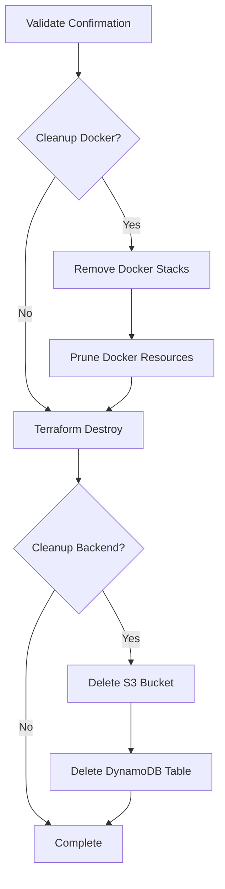

# Infrastructure Cleanup Guide

This guide explains how to safely destroy all provisioned AWS resources for the WordPress Swarm infrastructure.

## ⚠️ Important Warning

**Cleanup is IRREVERSIBLE!** All data will be permanently deleted:
- EC2 instances (Manager + Workers)
- VPC and networking components
- Security groups
- Docker volumes and data
- WordPress content and database
- Portainer configuration
- Terraform state files (backend bucket/table preserved but emptied)

**Always backup important data before proceeding!**

---

## Cleanup Methods

### Method 1: GitHub Actions (Recommended)

The GitHub Actions workflow provides a safe, audited cleanup process with confirmation steps.

#### Steps:

1. **Navigate to Actions**
   - Go to: `https://github.com/YOUR_USERNAME/redLUIT_Dec2025_Docke04_WordPress/actions`
   - Click on "Cleanup Infrastructure" workflow

2. **Trigger the Workflow**
   - Click "Run workflow"
   - Configure options:
     - **Confirm destroy**: Type `destroy` exactly
     - **Cleanup Docker**: `true` (removes Docker stacks/volumes first)
     - **Cleanup backend**: `true` (clears state files, keeps bucket/table)

3. **Monitor Progress**
   - Watch the workflow execution
   - Check the summary for results

#### Workflow Steps:



#### What Gets Cleaned Up:

**Always:**
- ✓ EC2 instances
- ✓ VPC and subnets
- ✓ Security groups
- ✓ Internet gateway
- ✓ Route tables

**If Cleanup Docker = true:**
- ✓ WordPress stack
- ✓ Portainer stack and agent
- ✓ Docker volumes
- ✓ Docker networks
- ✓ All images and containers

**If Cleanup Backend = true:**
- ✓ S3 bucket contents (all state files and versions)
- ✓ DynamoDB table items (all lock entries)
- ℹ️ S3 bucket and DynamoDB table are preserved for reuse
- ℹ️ You can redeploy immediately without recreating backend

---

### Method 2: Local Script

For manual cleanup with full control.

#### Prerequisites:

- AWS CLI configured with proper credentials
- Terraform installed (v1.6.0+)
- SSH access to instances (for Docker cleanup)

#### Steps:

1. **Navigate to Terraform directory**
   ```bash
   cd infra/terraform
   ```

2. **Set SSH key path** (optional, for Docker cleanup)
   ```bash
   export SSH_KEY_PATH="$HOME/.ssh/your-key.pem"
   ```

3. **Run cleanup script**
   ```bash
   ./cleanup.sh
   ```

4. **Follow prompts**
   - Confirm infrastructure destruction
   - Choose Docker cleanup
   - Choose backend cleanup

#### Script Features:

- ✓ Interactive confirmations
- ✓ Color-coded output
- ✓ Detailed progress logging
- ✓ Graceful Docker cleanup
- ✓ Backend cleanup option
- ✓ Error handling

---

### Method 3: Manual Terraform Destroy

For advanced users who want direct control.

#### Steps:

1. **Clean up Docker resources** (optional but recommended)
   ```bash
   # SSH into manager node
   ssh -i your-key.pem ubuntu@<manager-ip>

   # Remove stacks
   docker stack rm wordpress
   docker stack rm portainer

   # Wait for services to stop
   sleep 30

   # Prune all resources
   docker system prune -af --volumes
   ```

2. **Destroy Terraform infrastructure**
   ```bash
   cd infra/terraform
   terraform init
   terraform destroy
   ```

3. **Confirm destruction**
   - Review the destroy plan
   - Type `yes` to confirm

4. **Clear backend contents** (optional)
   ```bash
   # Empty S3 bucket (preserves bucket)
   aws s3 rm s3://ec2-shutdown-lambda-bucket --recursive

   # Delete all versions
   aws s3api delete-objects \
     --bucket ec2-shutdown-lambda-bucket \
     --delete "$(aws s3api list-object-versions \
       --bucket ec2-shutdown-lambda-bucket \
       --output json \
       --query '{Objects: Versions[].{Key:Key,VersionId:VersionId}}')"

   # Clear DynamoDB table items (preserves table)
   aws dynamodb scan --table-name dyning_table \
     --attributes-to-get "LockID" --output json | \
     jq -r '.Items[] | .LockID.S' | \
     while read -r lock_id; do
       aws dynamodb delete-item \
         --table-name dyning_table \
         --key "{\"LockID\": {\"S\": \"$lock_id\"}}"
     done
   ```

---

## Cleanup Verification

### After Cleanup, Verify:

**AWS Console:**
1. EC2 Dashboard → No running instances
2. VPC Dashboard → Custom VPC removed
3. S3 → State bucket exists/deleted (based on choice)

**Command Line:**
```bash
# Check for running instances
aws ec2 describe-instances --region us-east-1 \
  --filters "Name=tag:Project,Values=WordPress-Swarm" \
  --query "Reservations[].Instances[].InstanceId"

# Check VPC
aws ec2 describe-vpcs --region us-east-1 \
  --filters "Name=tag:Project,Values=WordPress-Swarm"

# Check S3 bucket (if cleanup backend = false)
aws s3 ls | grep ec2-shutdown-lambda-bucket
```

**Terraform:**
```bash
cd infra/terraform
terraform show
# Should show: "No state" or empty state
```

---

## Troubleshooting

### Issue: Terraform destroy fails

**Problem:** Resources have dependencies preventing deletion

**Solution:**
```bash
# Force destroy with target
terraform destroy -target=aws_instance.swarm_worker
terraform destroy -target=aws_instance.swarm_manager
terraform destroy  # Destroy remaining resources
```

### Issue: Docker cleanup times out

**Problem:** SSH connection fails or services won't stop

**Solution:**
```bash
# Skip Docker cleanup and proceed with Terraform destroy
# Docker resources will be deleted when EC2 instances are terminated
```

### Issue: S3 bucket still has objects

**Problem:** Bucket not fully emptied

**Solution:**
```bash
# Empty all current objects
aws s3 rm s3://ec2-shutdown-lambda-bucket --recursive

# Delete all object versions
aws s3api delete-objects \
  --bucket ec2-shutdown-lambda-bucket \
  --delete "$(aws s3api list-object-versions \
    --bucket ec2-shutdown-lambda-bucket \
    --output json \
    --query '{Objects: Versions[].{Key:Key,VersionId:VersionId}}')"

# Delete all delete markers
aws s3api delete-objects \
  --bucket ec2-shutdown-lambda-bucket \
  --delete "$(aws s3api list-object-versions \
    --bucket ec2-shutdown-lambda-bucket \
    --output json \
    --query '{Objects: DeleteMarkers[].{Key:Key,VersionId:VersionId}}')"

# Verify bucket is empty
aws s3 ls s3://ec2-shutdown-lambda-bucket
```

### Issue: State lock error

**Problem:** DynamoDB table locked

**Solution:**
```bash
# Force unlock (use the Lock ID from error message)
terraform force-unlock <LOCK_ID>

# Or delete lock manually
aws dynamodb delete-item \
  --table-name dyning_table \
  --key '{"LockID": {"S": "terraform-state-lock"}}'
```

---

## Cost Implications

### Resources and Monthly Costs

| Resource | Estimated Cost/Month |
|----------|---------------------|
| EC2 t3.medium (4x) | ~$120 |
| VPC & Networking | Free tier |
| EBS Volumes (120GB) | ~$12 |
| Data Transfer | Variable |
| **Total** | **~$132/month** |

**Cleanup saves these costs immediately after resources are terminated.**

---

## Best Practices

### Before Cleanup:

1. ✓ **Backup WordPress data**
   ```bash
   # Export database
   docker exec wordpress-db mysqldump -u wordpress -p wordpress > backup.sql

   # Download WordPress files
   scp -i key.pem -r ubuntu@<manager-ip>:/var/lib/docker/volumes ./backup/
   ```

2. ✓ **Export Portainer configuration**
   - Log into Portainer
   - Settings → Export configuration

3. ✓ **Document custom configurations**
   - Security group modifications
   - DNS records
   - SSL certificates

### During Cleanup:

1. ✓ Use GitHub Actions for audit trail
2. ✓ Clean up Docker first (graceful shutdown)
3. ✓ Keep backend unless absolutely necessary
4. ✓ Monitor cleanup progress

### After Cleanup:

1. ✓ Verify all resources deleted (AWS Console)
2. ✓ Check for orphaned resources
3. ✓ Remove DNS records
4. ✓ Revoke temporary credentials
5. ✓ Document cleanup date

---

## Recovery

### To Redeploy After Cleanup:

Since backend bucket and table are preserved:
```bash
# Just redeploy - no backend recreation needed
git push origin main
# Workflow will recreate infrastructure using existing backend
```

If you need to recreate backend (advanced):
```bash
# Only if you manually deleted the bucket/table
cd infra/terraform
./setup-backend.sh

# Initialize Terraform
terraform init

# Deploy via workflow or manual apply
terraform apply
```

---

## Support

### Getting Help:

- **Issues**: [GitHub Issues](https://github.com/shehuj/redLUIT_Dec2025_Docke04_WordPress/issues)
- **Logs**: Check GitHub Actions workflow logs
- **AWS Support**: For AWS-specific issues

### Reporting Cleanup Problems:

Include:
- Cleanup method used
- Error messages
- Terraform state output
- AWS region
